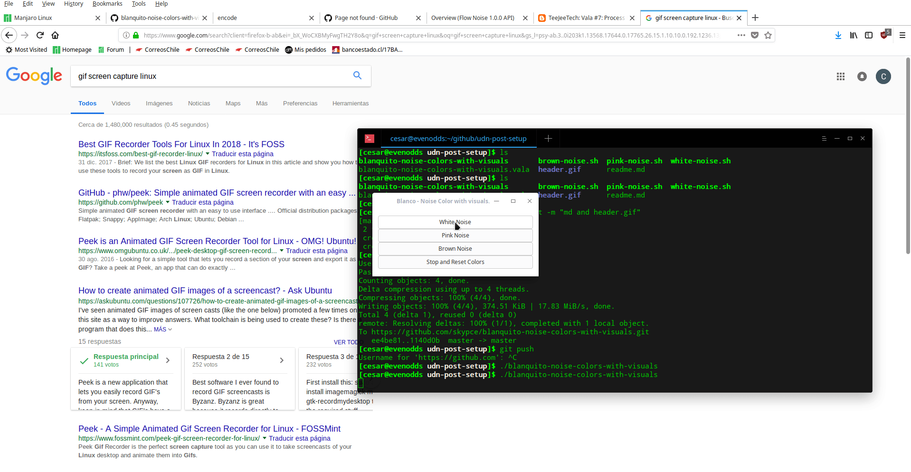

# Blanquito Noise colors with visuals for Linux
 

A little utility thats generates white, pink and brown noise colors and apply a filter of color for the respective noise. (Only works with Nvidia Cards.)



## Installation

Ubuntu:

```sh
Depends of Nvidia propietary drivers and SOX audio utility.


## Usage example

Click in the noise that you want listen and automatically will reproduce the noise sound of your election and apply the color filter for the respective noise.
## Release History

* 0.1
    * First Release.

## Meta

César R. Cid Méndez – [@YourTwitter](https://twitter.com/skypce) – skypce@gmail.com
Credits to https://github.com/soimort/translate-shell by his awesome translation script.
Distributed under the GPL license. See ``LICENSE`` for more information.

[https://github.com/skypce/secure-passwords-script](https://github.com/skypce/secure-passwords-script)

